# stm32_mastering_mcu

## SPI (Send/Recv blocking)
#
- 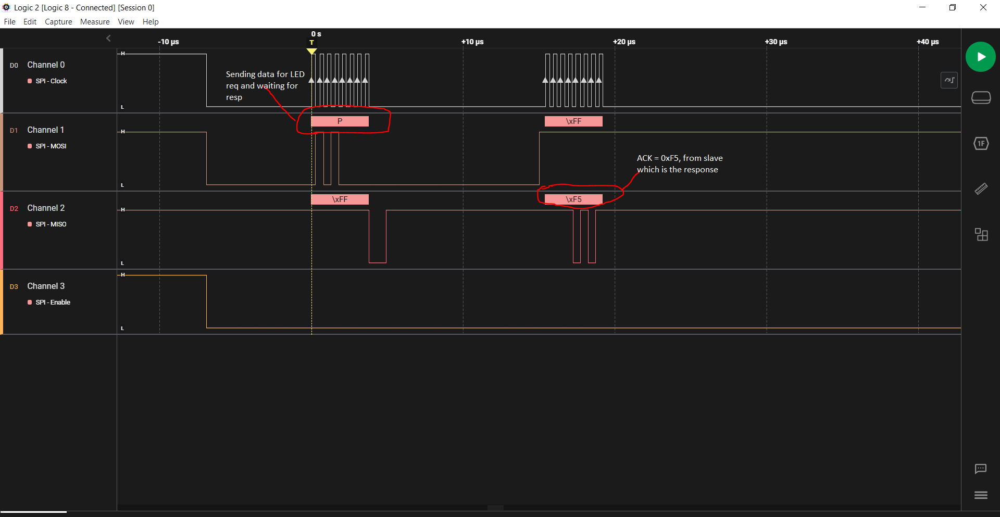
- 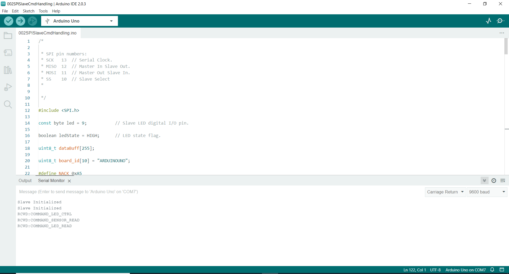
- 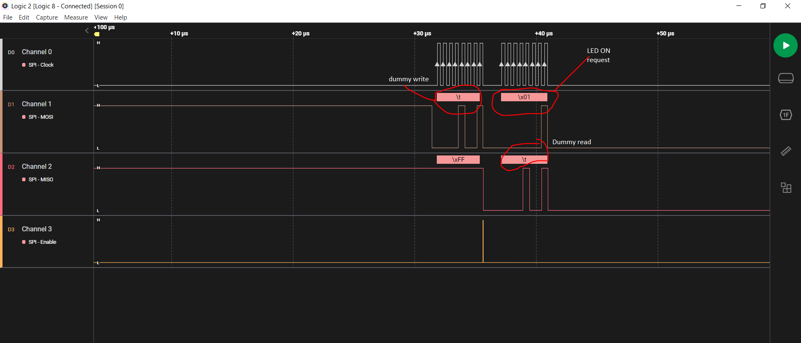
- 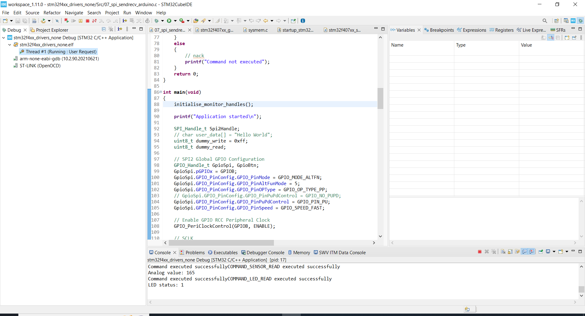
#

## SPI RX IT (Interrupt Recv - nonblocking)
#
- 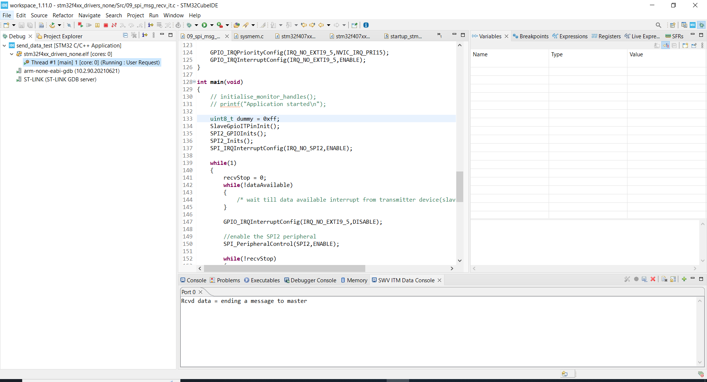
- 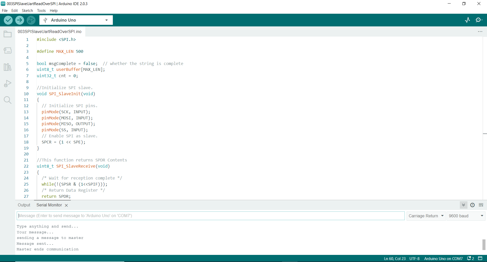
#

## I2C BTN TX (Send - blocking)
#
- 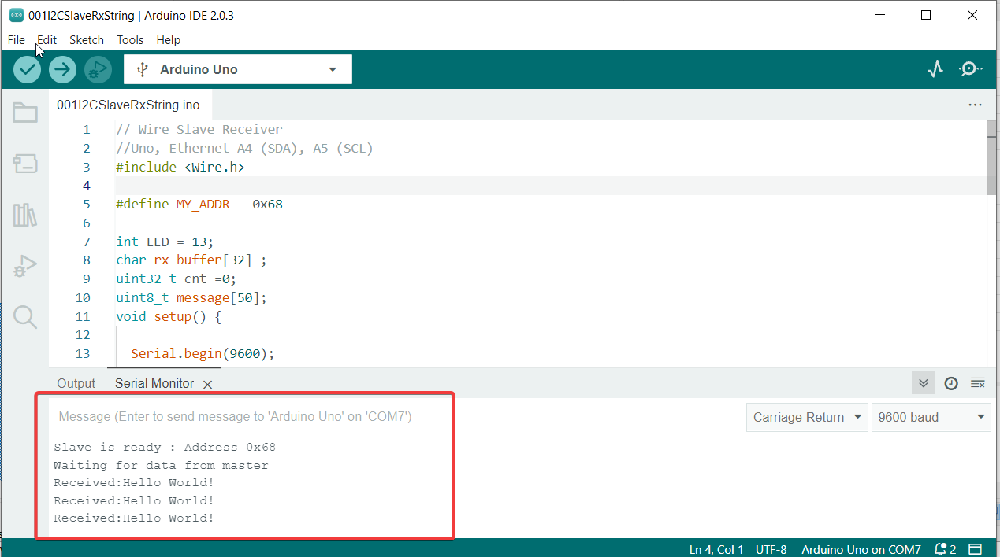
- 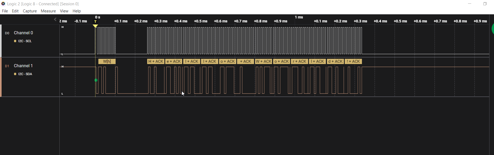
#

## I2C BTN RX (Recv - blocking)
#
- 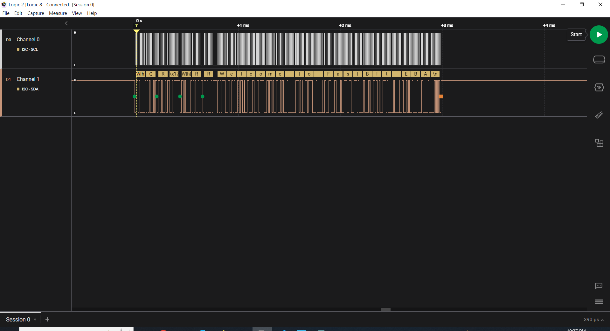
- 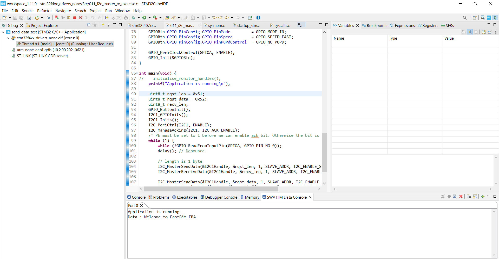
#

## I2C RX IT (Interrupt Recv - nonblocking)
#
- 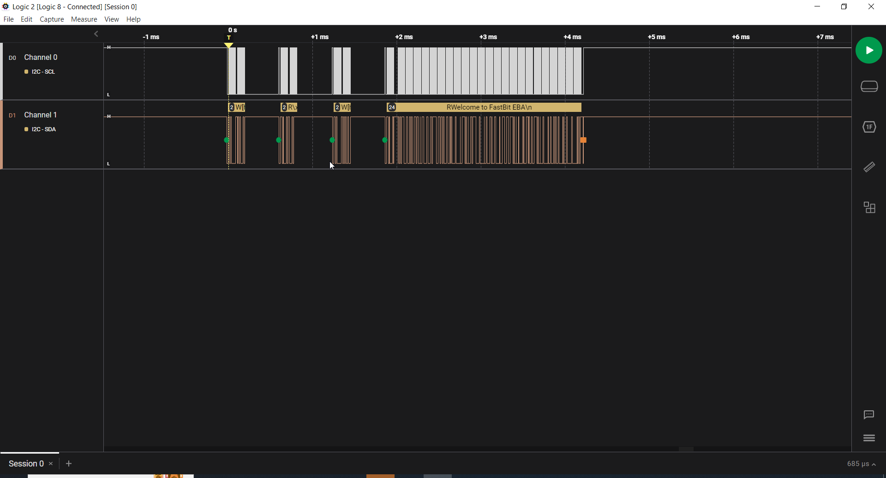
- 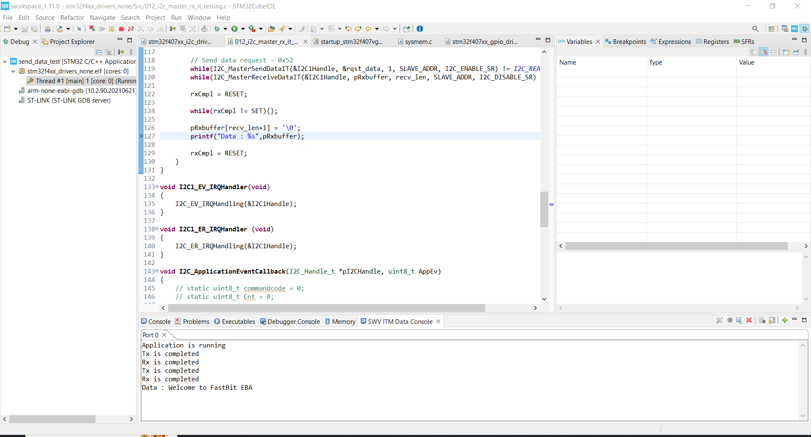
#